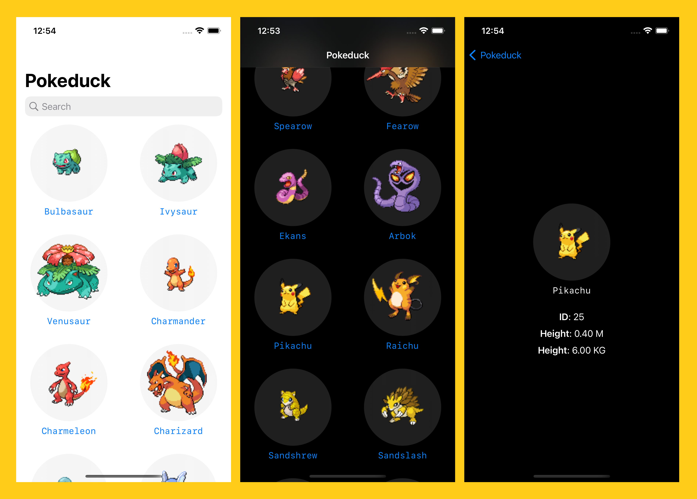
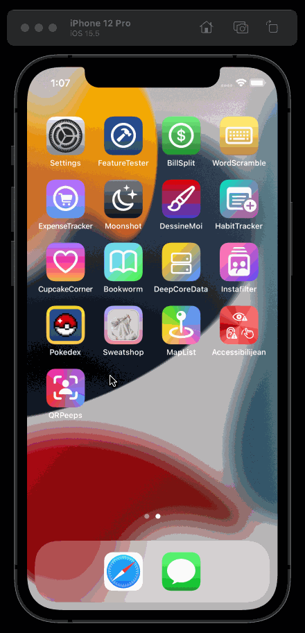

# Pokedex
This app was developed using the [PokéAPI](https://pokeapi.co/).
An API call is made from a decoded name data held in a JSON file in the app's bundle.

MVVM pattern.
Contains error handling and [generics](https://docs.swift.org/swift-book/LanguageGuide/Generics.html) to maximise code reusability.

## App icon
Made using Figma.

  

## Media

  

## Preview GIF
Pokedex app demo.

  

